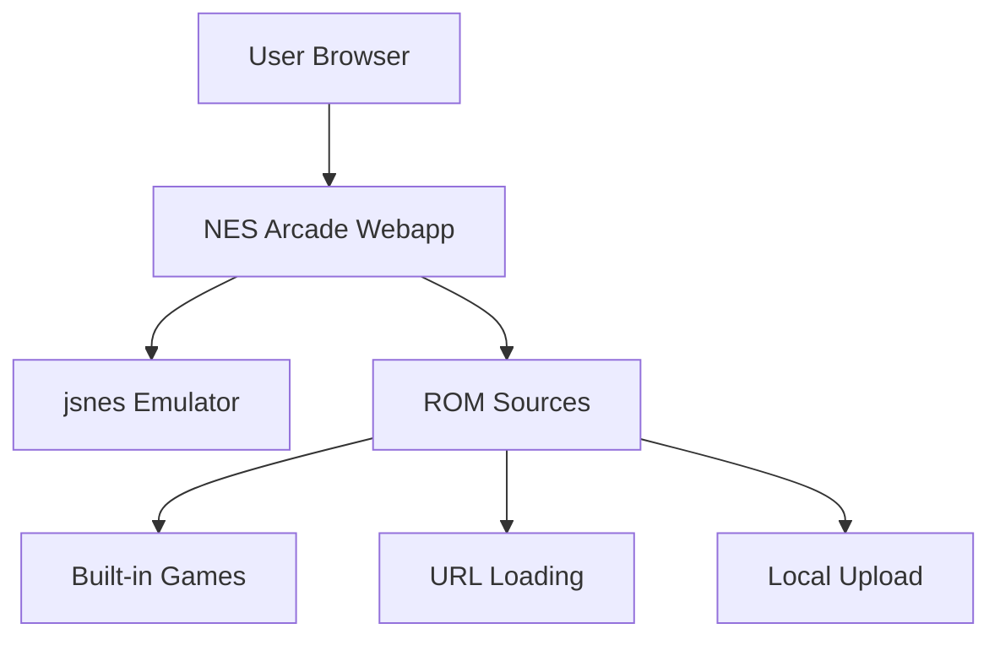

# NES Arcade Webapp

A web-based Nintendo Entertainment System (NES) emulator that lets you play classic NES games directly in your browser.

## Overview

This is a modern web application that provides a nostalgic gaming experience by emulating the original Nintendo Entertainment System. Built with Node.js and the jsnes library, it features a retro-styled interface with CRT effects, support for loading ROMs from URLs or local files, and includes a curated library of public domain/homebrew NES games.

## Features

- **🎮 NES Emulation**: Play authentic NES games using the jsnes emulator library
- **📥 Flexible ROM Loading**: Load games from URLs, upload from your device, or use built-in games
- **🕹️ Keyboard Controls**: Full NES controller mapping using keyboard keys
- **📺 CRT Effect**: Authentic retro CRT screen overlay effect
- **🔍 Game Search**: Quick search through available games
- **📱 Responsive Design**: Works on desktop and mobile browsers
- **🎨 Retro Styling**: NES-themed UI with pixel fonts and nostalgic design

## Architecture



## Tech Stack

| Component | Technology | Version |
|-----------|-----------|---------|
| Runtime | Node.js | >=18.0.0 |
| Framework | Express | ^4.18.2 |
| Emulator | jsnes | ^1.2.1 |
| Middleware | Compression, CORS, Morgan | - |

## Quick Start

### Using Docker (Recommended)

```bash
# Clone the repository
git clone https://github.com/ellickjohnson/arcade-webapp.git
cd arcade-webapp

# Start the application
docker-compose up -d

# Access the application
open http://localhost:3000
```

### Local Development

```bash
# Install dependencies
npm install

# Start the application in development mode
npm run dev

# Start in production mode
npm start
```

## Controls

### NES Controller Mapping

| NES Controller | Keyboard Key |
|----------------|--------------|
| D-Pad (Up) | ↑ |
| D-Pad (Down) | ↓ |
| D-Pad (Left) | ← |
| D-Pad (Right) | → |
| A Button | Z |
| B Button | X |
| Start | Enter |
| Select | Shift |

### UI Controls

- **Click game area** to focus and enable keyboard controls
- **F11** or ⛶ button for fullscreen mode
- **🔄** button to restart the game

## Built-in Games

The application includes several public domain/homebrew NES games:

- **Little Medusa** - A puzzle game where you help Medusa escape a maze
- **Neko** - A cute cat adventure game
- **Concentration Room** - A memory matching game
- **Driar** - A dragon-themed platformer

## Configuration

### Environment Variables

| Variable | Required | Description | Default |
|----------|----------|-------------|---------|
| `PORT` | No | Application port | `3000` |
| `NODE_ENV` | No | Environment | `development` |

### Docker Configuration

- **Image:** `ghcr.io/ellickjohnson/arcade-webapp:latest`
- **Restart Policy:** `unless-stopped`
- **Health Check:** `/health` endpoint

## API Documentation

### Health Check

```bash
GET /health
```

Returns the health status of the application.

### Get Games List

```bash
GET /api/games
```

Returns a list of all available NES games.

Response example:
```json
{
  "games": [
    {
      "id": "nes/little-medusa",
      "name": "Little Medusa",
      "category": "Puzzle",
      "platform": "nes",
      "description": "A puzzle game where you help Medusa escape a maze",
      "year": "2010",
      "romPath": "https://raw.githubusercontent.com/freeman12x/nes-roms/main/homebrew/little-medusa.nes",
      "screenshot": null
    }
  ]
}
```

## Development

### Project Structure

```
.
├── public/            # Static files (HTML, CSS, JS)
│   ├── index.html    # Main HTML file
│   ├── app.js        # Frontend JavaScript
│   └── styles.css    # NES-themed styles
├── src/              # Source code
│   └── server.js     # Express server
├── games/            # Local ROM storage
├── Dockerfile        # Docker image definition
├── docker-compose.yml # Docker compose configuration
└── package.json      # Node.js dependencies
```

## Deployment

### Automated Deployment (CI/CD)

This project uses GitHub Actions for automated builds and deployments.

1. Push to `main` branch → Builds and pushes Docker image to GHCR
2. Pull latest image in Portainer to deploy

### Manual Deployment

```bash
# Build Docker image
docker build -t ghcr.io/ellickjohnson/arcade-webapp:latest .

# Push to GHCR
docker push ghcr.io/ellickjohnson/arcade-webapp:latest
```

### Portainer Deployment

Use Portainer to deploy the stack with the following docker-compose.yml:

```yaml
version: '3.8'
services:
  arcade-webapp:
    image: ghcr.io/ellickjohnson/arcade-webapp:latest
    container_name: arcade-webapp
    restart: unless-stopped
    ports:
      - "3000:3000"
    environment:
      - NODE_ENV=production
      - PORT=3000
```

## Troubleshooting

### Common Issues

**Issue:** Game won't load
```bash
# Check browser console for errors
# Verify ROM URL is accessible
# Ensure you click the game area to focus
```

**Issue:** Keyboard controls not responding
```bash
# Click the game canvas to focus it
# Check browser console for errors
# Ensure no other window has focus
```

**Issue:** Container won't start
```bash
# Check logs
docker logs arcade-webapp

# Verify port 3000 is available
netstat -an | grep 3000
```

## Legal Notice

This emulator is designed for playing:
1. Public domain games
2. Homebrew games created by independent developers
3. Games you own and have the legal right to play

Please respect copyright laws and only play games you have the right to use.

## Contributing

1. Fork the repository
2. Create a feature branch (`git checkout -b feature/amazing-feature`)
3. Commit your changes (`git commit -m 'Add amazing feature'`)
4. Push to the branch (`git push origin feature/amazing-feature`)
5. Open a Pull Request

## License

This project is licensed under the MIT License - see the [LICENSE](LICENSE) file for details.

## Credits

- **jsnes** - NES emulator library by Ben Firshman
- **NES ROMs** - Homebrew games from various developers
- **Retro Design** - Inspired by classic NES aesthetics

---

**Last Updated:** March 3, 2026
**Maintained by:** ellickjohnson
