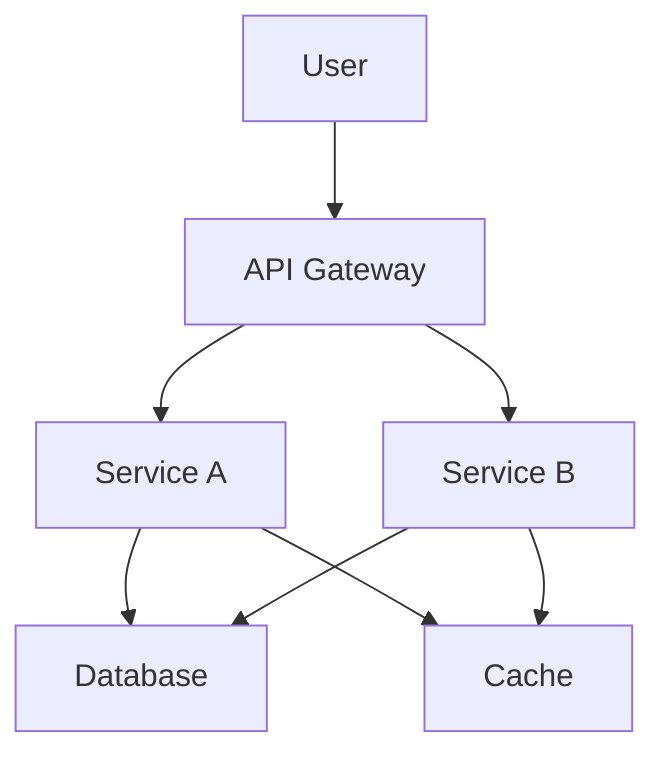

# [Project Name]

[Short description of what this project does]

## Overview

[Detailed description of the project, its purpose, and main features]

## Architecture



## Tech Stack

| Component | Technology | Version |
|-----------|-----------|---------|
| Runtime | [Node.js/Python/etc] | [Version] |
| Framework | [Express/FastAPI/etc] | [Version] |
| Database | [PostgreSQL/MongoDB/etc] | [Version] |
| Cache | [Redis/etc] | [Version] |
| Message Queue | [RabbitMQ/Kafka/etc] | [Version] |

## Prerequisites

- Docker and Docker Compose
- [Other prerequisites]
- [Other prerequisites]

## Quick Start

### Using Docker (Recommended)

```bash
# Clone the repository
git clone https://github.com/ellickjohnson/arcade-webapp.git
cd arcade-webapp

# Copy environment file
cp .env.example .env

# Edit .env with your configuration
nano .env

# Start the application
docker-compose up -d

# Check logs
docker-compose logs -f

# Access the application
open http://localhost:<port>
```

### Local Development

```bash
# Install dependencies
npm install  # or: pip install -r requirements.txt

# Copy environment file
cp .env.example .env

# Run database migrations (if applicable)
npm run migrate  # or: alembic upgrade head

# Start the application
npm run dev  # or: python main.py

# Run tests
npm test  # or: pytest
```

## Configuration

### Environment Variables

| Variable | Required | Description | Default |
|----------|----------|-------------|---------|
| `PORT` | No | Application port | `3000` |
| `DATABASE_URL` | Yes | Database connection string | - |
| `REDIS_URL` | Yes | Redis connection string | - |
| `LOG_LEVEL` | No | Logging level | `info` |
| `NODE_ENV` | No | Environment | `development` |

### Docker Configuration

- **Image:** `ghcr.io/ellickjohnson/arcade-webapp:latest`
- **Restart Policy:** `unless-stopped`
- **Health Check:** `/health` endpoint
- **Resource Limits:** Memory: 512MB, CPU: 0.5

## API Documentation

### Health Check

```bash
GET /health
```

Returns the health status of the application.

### [Main API Endpoint]

```bash
[Method] /[endpoint]
```

[Description of what this endpoint does]

## Development

### Project Structure

```
.
├── src/               # Source code
│   ├── controllers/   # Request handlers
│   ├── services/      # Business logic
│   ├── models/        # Data models
│   � routes/          # API routes
│   ├── middleware/    # Custom middleware
│   └── utils/         # Utility functions
├── tests/             # Test files
├── config/            # Configuration files
├── scripts/           # Utility scripts
├── Dockerfile         # Docker image definition
├── docker-compose.yml # Docker compose configuration
└── README.md          # This file
```

### Running Tests

```bash
# Run all tests
npm test

# Run tests with coverage
npm run test:coverage

# Run specific test file
npm test -- path/to/test.spec.js
```

### Code Quality

```bash
# Format code
npm run format

# Lint code
npm run lint

# Type check (if TypeScript)
npm run type-check
```

## Deployment

### Automated Deployment (CI/CD)

This project uses GitHub Actions for automated builds and deployments.

1. Push to `main` branch → Builds and pushes Docker image to GHCR
2. Create release tag → Creates GitHub release
3. Manual deploy to Portainer using image from GHCR

### Manual Deployment

```bash
# Build Docker image
docker build -t ghcr.io/ellickjohnson/arcade-webapp:latest .

# Push to GHCR
docker push ghcr.io/ellickjohnson/arcade-webapp:latest

# Deploy to Portainer
# Use Portainer UI to deploy the stack
```

### Rollback Procedure

```bash
# Use the rollback script
./scripts/rollback.sh arcade-webapp <previous-tag>

# Or manually via Portainer
# 1. Go to Stack settings
# 2. Edit docker-compose.yml
# 3. Change image tag to previous version
# 4. Update the stack
```

## Monitoring & Observability

### Health Checks

- **Liveness:** `GET /health/live` - Container is running
- **Readiness:** `GET /health/ready` - Ready to receive traffic
- **Detailed:** `GET /health` - Full health status

### Logging

Logs are written to:
- Docker container logs: `docker logs <container>`
- [Centralized logging if configured]

### Metrics

Metrics are exposed at `/metrics` (if configured)

## Troubleshooting

### Common Issues

**Issue:** Container won't start
```bash
# Check logs
docker logs <container-name>

# Check environment variables
docker exec <container-name> env
```

**Issue:** Database connection failed
```bash
# Check database container
docker ps | grep db

# Test connection
docker exec <container-name> sh -c "nc -zv $DATABASE_HOST 5432"
```

**Issue:** High memory usage
```bash
# Check resource usage
docker stats

# Restart container
docker restart <container-name>
```

## Security

- Secrets are managed via environment variables
- No secrets are committed to the repository
- Dependencies are scanned for vulnerabilities
- Container runs as non-root user
- Security headers are configured

## Contributing

1. Fork the repository
2. Create a feature branch (`git checkout -b feature/amazing-feature`)
3. Commit your changes (`git commit -m 'Add amazing feature'`)
4. Push to the branch (`git push origin feature/amazing-feature`)
5. Open a Pull Request

## License

This project is licensed under the MIT License - see the [LICENSE](LICENSE) file for details.

## Support

For support, email [support@email] or open an issue in the repository.

## Changelog

See [CHANGELOG.md](CHANGELOG.md) for a history of changes.

---

**Last Updated:** [Date]
**Maintained by:** [Your Name/Team]
